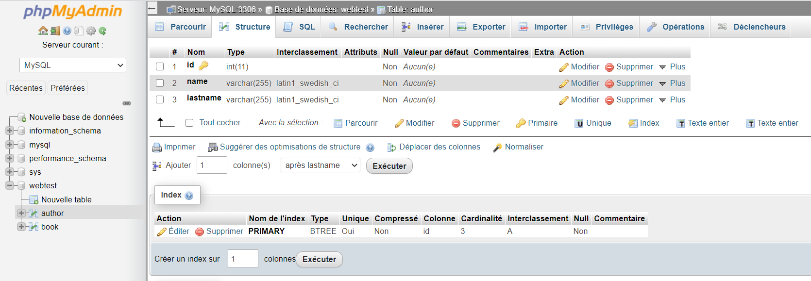
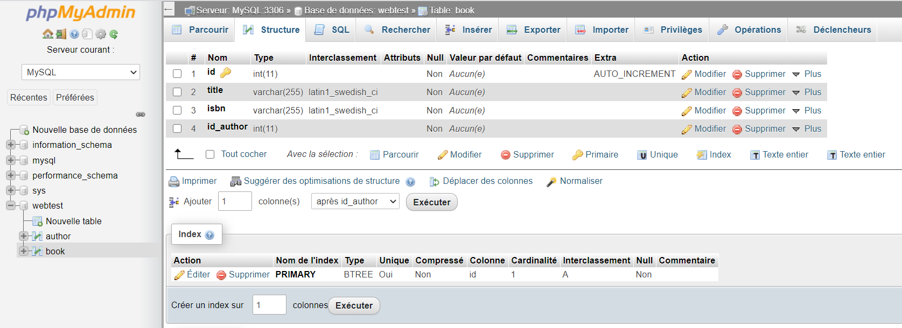
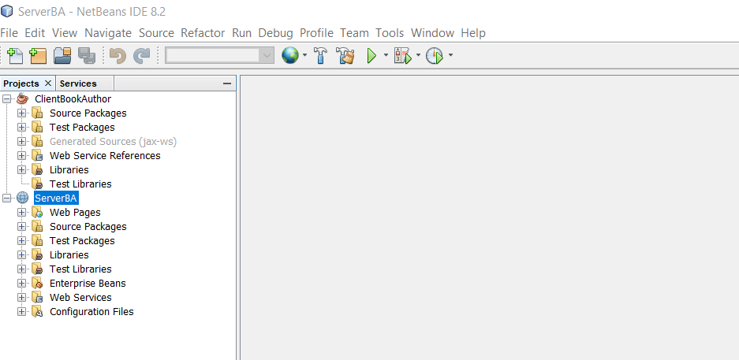

<h1>Création d'un service web soap avec Java</h1>
<h4>Architecture et fonctionnement</h4>

Le service web est composé d'un client java et d'un serveur soap sous l'environnement netbeans. 
il contient également une base de donnée mysql sur laquelle sont enregistrés les auteurs et l'ensemble des livres qu'ils ont publiés.

  Création d'une base donnée <b>webtest</b> sous mysql

  Création d'une table <b>autor</b> 
  

  Création d'une table <b>book</b> 
  

  Arborescence du client et du serveur
  

